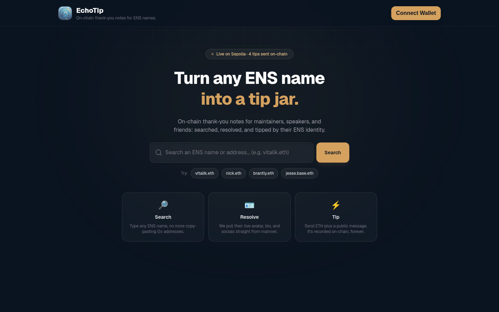
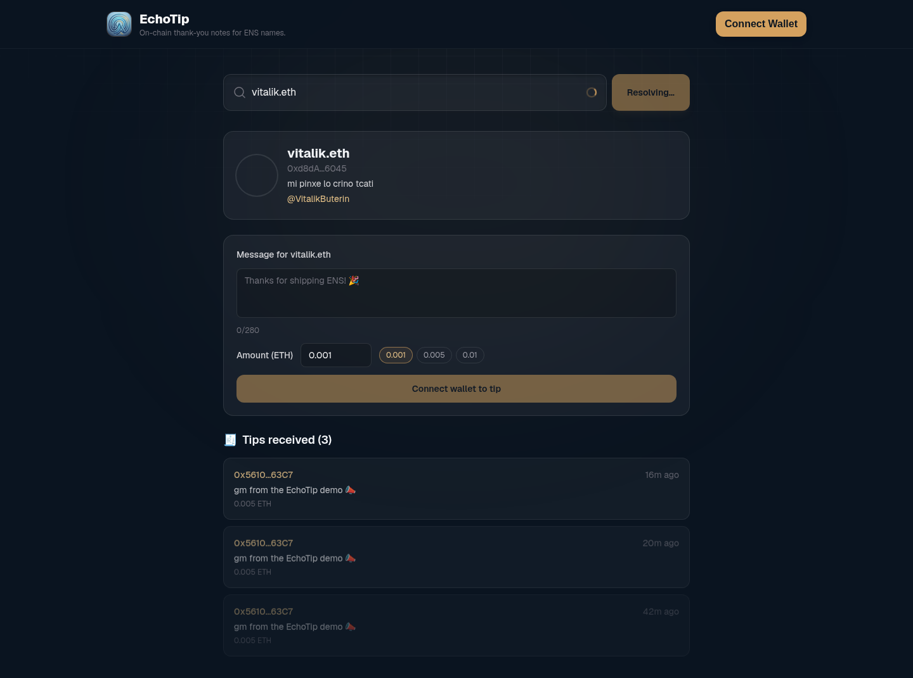
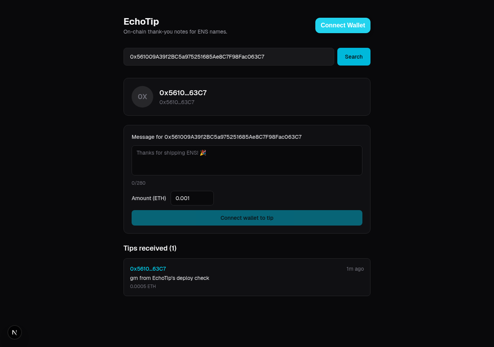

# EchoTip

**On-chain thank-you notes for ENS names.** Type in anyone's ENS name, see their resolved profile (avatar, bio, Twitter), and leave them a public on-chain tip + message: no more copy-pasting 0x addresses.

Built for the **ENS track** (Best Use of ENS): the entire UX depends on ENS name resolution, since searching, resolving, and displaying a profile is impossible without it.

## What it does

1. Type an ENS name (e.g. `vitalik.eth`) or a raw address into the search box. It auto-resolves ~400ms after you stop typing a complete-looking name (no need to hit Search), or click one of the quick-pick example names.
2. EchoTip resolves it against **Ethereum mainnet** via viem's ENS actions: address, avatar, `description` text record, and `com.twitter` handle.
3. Send them a small ETH tip with a public message. The transaction goes to a lightweight smart contract on **Sepolia** testnet.
4. Every tip is stored on-chain and rendered as a live "wall" under the recipient's profile. Each sender is reverse-resolved to their own ENS name too, so the wall reads as `alice.eth tipped bob.eth`, not addresses talking to addresses.

## Tech stack

| Layer | Choice |
|---|---|
| Smart contract | Solidity ^0.8.24, built/tested/deployed with **Foundry** |
| Contract network | Sepolia testnet |
| ENS resolution | viem's ENS actions (`getEnsAddress`, `getEnsAvatar`, `getEnsText`, `getEnsName`) against Ethereum **mainnet** |
| Frontend | Next.js (App Router) + TypeScript + Tailwind CSS |
| Web3 hooks | wagmi v2 + viem |
| Wallet connect | RainbowKit |

## Deployed contract

- **Address (Sepolia):** [`0x4b7cCF136f9f96c471E04bDAE987119430f99C40`](https://sepolia.etherscan.io/address/0x4b7ccf136f9f96c471e04bdae987119430f99c40)
- **Verified source:** Etherscan verification passed, see the link above (Code tab).
- **Example transaction:** [`0x5988d0b68a684f357d6cafe5884ae9e536db8be950a13f9d84e13cfbdd9e4835`](https://sepolia.etherscan.io/tx/0x5988d0b68a684f357d6cafe5884ae9e536db8be950a13f9d84e13cfbdd9e4835), a real tip sent while QA-ing the deploy.

## Screenshots

**Landing page: live on-chain tip count, quick-pick ENS names, and a search bar that auto-resolves once you finish typing a name (no click needed):**



**Searching an ENS name resolves a live profile from mainnet:**



**The tip wall reads tips straight from the Sepolia contract:**



## Project structure

```
echotip/
├── contracts/              # Foundry project
│   ├── src/TipBoard.sol
│   ├── test/TipBoard.t.sol
│   └── script/Deploy.s.sol
├── app/                     # Next.js App Router
│   ├── page.tsx
│   ├── layout.tsx
│   ├── providers.tsx
│   ├── components/
│   │   ├── ProfileSearch.tsx
│   │   ├── ProfileCard.tsx
│   │   ├── TipForm.tsx
│   │   └── MessageWall.tsx
│   └── lib/
│       ├── wagmiConfig.ts
│       ├── ensClient.ts
│       └── contract.ts
├── .env.example
└── README.md
```

## Local setup

### Frontend

```bash
npm install
cp .env.example .env.local   # fill in NEXT_PUBLIC_WALLETCONNECT_PROJECT_ID (free from cloud.reown.com)
npm run dev
```

The contract address and a public mainnet RPC are already filled in `.env.example` and default in code, so the app works out of the box for reading. You only need a WalletConnect project ID to connect a wallet and send tips.

### Contracts (Foundry)

```bash
cd contracts
cp .env.example .env   # fill in PRIVATE_KEY (throwaway test wallet only) + an RPC URL
forge build
forge test
forge script script/Deploy.s.sol:DeployScript --rpc-url $SEPOLIA_RPC_URL --broadcast
```

## Smart contract

`TipBoard.sol` stores tips per recipient as `(sender, amount, message, timestamp)` structs and emits a `TipSent` event on every tip. `getTips(address)` returns a recipient's full tip history; `getTipCount(address)` and `totalTips()` are cheap counters. Messages are capped at 280 characters on-chain.

Tested with Foundry (`contracts/test/TipBoard.t.sol`): sending a tip emits the event, stores the entry, and transfers the ETH to the recipient; invalid recipients and over-long messages revert.

## Why ENS

The core interaction, searching, resolving, and displaying a profile, is impossible without ENS. It's not a bolt-on integration; ENS name resolution *is* the product's UX. Reverse-resolving tip senders back to their own ENS names is what turns the tip wall from a list of addresses into a wall of names.

## AI tool usage disclosure

This project was built with assistance from Claude Code (Anthropic), including contract/test/deploy scaffolding and the frontend implementation, per the build spec in `build.md`.
